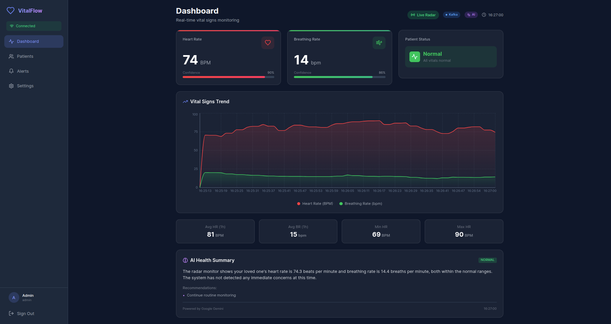

# VitalFlow-Radar

[](https://opensource.org/licenses/MIT)


**Cloud-Native Real-time Vital Signs Monitoring with mmWave Radar**

A distributed contactless vital signs monitoring system using TI AWR1642 radar, Confluent Cloud Kafka streaming, Google Cloud Vertex AI, FastAPI backend, and React frontend. Designed for scalable deployment with edge processing and cloud analytics.



## 🌟 Features

- **Contactless Monitoring**: Heart rate and breathing rate detection using 77GHz mmWave radar
- **Real-time Streaming**: Kafka-based data pipeline via Confluent Cloud
- **AI-Powered Insights**: Vertex AI Gemini for anomaly detection and health summaries
- **Edge Processing**: Complete DSP pipeline at edge for low latency
- **Modern Dashboard**: React UI with real-time WebSocket updates
- **Scalable Architecture**: Multiple edge devices → centralized cloud monitoring
- **Alert System**: Intelligent anomaly detection with AI-generated recommendations
- **Production Ready**: Deployed on Raspberry Pi with cloud backend

## 🏗️ Architecture

```
┌──────────────────────────────────────────────────────────────────────┐
│                         VitalFlow-Radar System                       │
├──────────────────────────────────────────────────────────────────────┤
│                                                                       │
│  Edge Device (Raspberry Pi)                                          │
│  ┌─────────────┐    ┌──────────────────────────────┐                │
│  │   AWR1642   │───▶│  edge_producer_live.py       │                │
│  │   Radar     │    │  - Range bin selection       │                │
│  └─────────────┘    │  - DSP processing            │                │
│                     │  - Vital signs extraction    │                │
│                     └───────────┬──────────────────┘                │
│                                 │                                    │
│                                 ↓                                    │
│                     ┌───────────────────────────────┐               │
│                     │   Confluent Cloud (Kafka)     │               │
│                     │   - vitalflow-radar-phase     │               │
│                     │   - vitalflow-vital-signs     │               │
│                     └───────────┬───────────────────┘               │
│                                 │                                    │
│                                 ↓                                    │
│  Cloud Backend                                                       │
│  ┌──────────────────────────────────────────────────────┐          │
│  │  backend/main.py (FastAPI)                           │          │
│  │  ┌─────────────────┐  ┌──────────────────────────┐  │          │
│  │  │ Kafka Consumer  │  │  WebSocket Broadcast     │  │          │
│  │  └─────────────────┘  └──────────────────────────┘  │          │
│  │  ┌─────────────────┐  ┌──────────────────────────┐  │          │
│  │  │ REST API        │  │  Vertex AI Integration   │  │          │
│  │  └─────────────────┘  └──────────────────────────┘  │          │
│  └──────────────────────────┬───────────────────────────┘          │
│                             │                                       │
│                             ↓                                       │
│  ┌──────────────────────────────────────────────────────┐         │
│  │        React Frontend (Vite + TypeScript)            │         │
│  │        - Real-time vital signs display               │         │
│  │        - AI health insights                          │         │
│  │        - Alert history                               │         │
│  └──────────────────────────────────────────────────────┘         │
│                                                                     │
└──────────────────────────────────────────────────────────────────────┘
```

## 📦 Tech Stack

### Edge (Producer)
- **Python 3.11**: Edge processing runtime
- **VitalSignsProcessor**: DSP algorithms (STFT, bandpass filters)
- **Confluent Kafka**: Real-time data streaming
- **AWR1642 Driver**: TI radar sensor interface

### Backend (Consumer/API)
- **FastAPI**: High-performance async Python framework
- **Confluent Kafka**: Consumer for vital signs stream
- **Vertex AI**: Gemini 1.5 Flash for AI insights
- **WebSocket**: Real-time client communication
- **SQLite**: Alerts and session storage

### Frontend
- **React 18**: Modern UI with hooks
- **TypeScript**: Type-safe JavaScript
- **TailwindCSS**: Utility-first styling
- **Recharts**: Responsive charts
- **Vite**: Fast build tool

## 🚀 Quick Start

### Prerequisites

1. **Sign up for free accounts:**
   - [Confluent Cloud](https://www.confluent.io/confluent-cloud/tryfree/) - Kafka streaming
   - [Google Cloud](https://cloud.google.com/free) - Vertex AI (optional)

2. **Hardware (for radar operation):**
   - TI AWR1642 mmWave Radar EVM
   - Raspberry Pi 4 or equivalent Linux system

### Setup

1. **Clone the repository:**
```bash
git clone https://github.com/ahmed100553/VitalFlow-Radar-Public
cd VitalFlow-Radar
```

2. **Configure environment:**
```bash
cp .env.example .env
# Edit .env with your Confluent Cloud and GCP credentials
```

3. **Install dependencies:**
```bash
# Backend
pip install -r requirements.txt
cd backend && pip install -r requirements.txt && cd ..

# Frontend
cd frontend
npm install
cd ..
```

4. **Start the system:**
```bash
# Development mode (starts both backend and frontend)
chmod +x scripts/start_dev.sh
./scripts/start_dev.sh
```

5. **Access the dashboard:**
   - Open http://localhost:5173
   - Login with default credentials: `admin` / `admin123`

### Production Deployment (Raspberry Pi)

```bash
chmod +x scripts/setup_raspberry_pi.sh
sudo ./scripts/setup_raspberry_pi.sh
```

### Docker Deployment

```bash
cd docker
docker-compose up -d
```

## 📁 Project Structure

```
VitalFlow-Radar/
├── backend/
│   ├── main.py              # FastAPI application
│   ├── requirements.txt     # Python dependencies
│   └── data/                # SQLite database
├── frontend/
│   ├── src/
│   │   ├── components/      # React components
│   │   ├── contexts/        # Auth & Vitals contexts
│   │   ├── pages/           # Dashboard, Patients, Settings
│   │   └── App.tsx          # Main application
│   ├── package.json
│   └── vite.config.ts
├── scripts/
│   ├── setup_raspberry_pi.sh  # Raspberry Pi setup
│   ├── setup_ssl.sh           # SSL configuration
│   └── start_dev.sh           # Development server
├── docker/
│   ├── Dockerfile
│   ├── docker-compose.yml
│   └── nginx.conf
├── awr1642_driver.py          # Radar driver (TLV parsing)
├── vital_signs_processor.py   # DSP algorithms
├── edge_producer_live.py      # Edge data producer
├── confluent_config.py        # Kafka configuration
├── vertex_ai_processor.py     # AI anomaly detection
├── vital_signs_awr1642.cfg    # Radar configuration
└── requirements.txt           # Core dependencies
```

## 🔌 API Endpoints

### REST API

| Method | Endpoint | Description |
|--------|----------|-------------|
| POST | `/api/auth/login` | User authentication |
| POST | `/api/auth/register` | User registration |
| GET | `/api/patients` | List patients |
| POST | `/api/patients` | Add patient |
| GET | `/api/vitals/{id}/current` | Current vital signs |
| GET | `/api/vitals/{id}/history` | Historical data (24h) |
| GET | `/api/alerts` | List alerts |
| GET | `/api/kafka/status` | Kafka connection status |
| GET | `/api/vertex/status` | Vertex AI status |

### WebSocket

```javascript
// Connect to real-time vital signs stream
const ws = new WebSocket('ws://localhost:8000/ws/patient-001');

ws.onmessage = (event) => {
  const data = JSON.parse(event.data);
  console.log(`HR: ${data.heart_rate} BPM, BR: ${data.breathing_rate} BPM`);
};
```

**API Documentation:** http://localhost:8000/api/docs (Swagger UI)

## ⚙️ Configuration

### Environment Variables

Create a `.env` file from `.env.example`:

```bash
# Confluent Cloud (Required for streaming)
CONFLUENT_BOOTSTRAP_SERVERS=your-server.confluent.cloud:9092
CONFLUENT_API_KEY=your-api-key
CONFLUENT_API_SECRET=your-api-secret

# Google Cloud (Optional for AI features)
GOOGLE_CLOUD_PROJECT=your-gcp-project-id
VERTEX_AI_LOCATION=us-central1

# Application Settings
DEVICE_ID=radar-001
RADAR_FPS=10
ANALYSIS_WINDOW_SEC=30
```

### Radar Configuration

The `vital_signs_awr1642.cfg` file is optimized for vital signs monitoring:

| Parameter | Value | Description |
|-----------|-------|-------------|
| Frame Rate | 10 FPS | 100ms frame period |
| Range Resolution | 0.044m | Per range bin |
| ADC Samples | 256 | Per chirp |
| Chirps/Frame | 16 | For integration |
| Expected Range | 0.3-1.5m | Subject distance |

## ⚙️ Hardware Setup

**Connect TI AWR1642 EVM to Raspberry Pi:**
- **CLI Port**: `/dev/ttyACM0` (configuration)
- **Data Port**: `/dev/ttyACM1` (data stream)

```bash
# Add user to dialout group
sudo usermod -a -G dialout $USER
# Log out and back in

# Test connection
python example_awr1642_usage.py --simple
```

## 📊 Signal Processing Pipeline

The DSP pipeline implements research-validated algorithms:

1. **Range FFT**: Transform ADC samples to range domain
2. **MTI Filter**: Remove static clutter with exponential moving average
3. **Range Bin Selection**: Variance-based optimal bin (0.3-1.5m)
4. **Phase Extraction**: Unwrap, detrend, and smooth phase signal
5. **Band-pass Filtering**: Separate breathing (0.1-0.5 Hz) and cardiac (0.9-2.3 Hz) bands
6. **STFT Ridge Tracking**: Time-varying frequency estimation

## 💻 Usage Examples

### Python API

```python
from vital_signs_processor import VitalSignsProcessor

# Initialize processor
processor = VitalSignsProcessor(fps=10.0)

# Process phase signal
result = processor.extract_vital_signs(phase_signal)

print(f"Heart Rate: {result['hr_bpm']:.1f} BPM")
print(f"Breathing Rate: {result['br_bpm']:.1f} BPM")
```

### Command Line

```bash
# Real-time monitoring
python vital_signs_monitor.py --live --duration 60

# With live visualization
python vital_signs_monitor.py --live --plot --duration 120

# Edge producer (streams to Confluent Cloud)
python edge_producer_live.py
```

## 📈 Performance

- **Latency**: <100ms end-to-end (radar → cloud → dashboard)
- **Accuracy**: ±2 BPM heart rate, ±1 BPM breathing rate (vs. reference)
- **Range**: 0.3-1.5m optimal, up to 3m detectable
- **Throughput**: 10 frames/sec, ~1KB/frame

## 🤝 Contributing

Contributions are welcome! Please:

1. Fork the repository
2. Create a feature branch (`git checkout -b feature/amazing-feature`)
3. Commit your changes (`git commit -m 'Add amazing feature'`)
4. Push to the branch (`git push origin feature/amazing-feature`)
5. Open a Pull Request

## 📄 License

This project is licensed under the MIT License - see the [LICENSE](LICENSE) file for details.

## 🙏 Acknowledgments

- **Texas Instruments** for AWR1642 mmWave SDK
- **Confluent** for Kafka streaming platform
- **Google Cloud** for Vertex AI and Gemini
- Research papers on mmWave vital signs monitoring

## 📞 Support

- **Issues**: Open a GitHub issue for bugs or feature requests
- **Discussions**: Use GitHub Discussions for questions
---

**Built with ❤️ for contactless health monitoring**
